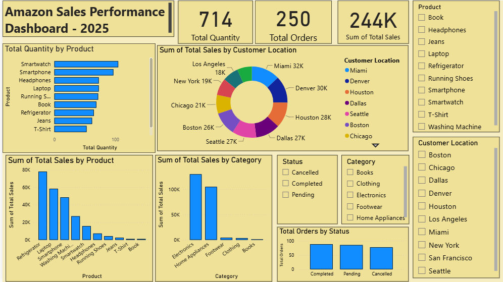

Amazon Sales Performance Dashboard – 2025

📊 Project Overview

An interactive Amazon Sales Performance Dashboard developed using Microsoft Power BI to analyze 2025 sales data and provide insights into sales performance, products, categories, customer locations, and order status.

The dashboard transforms raw sales data into meaningful KPIs, visualizations, and business insights to support data-driven analysis and decision-making.

## 📊 Dashboard Preview

🛠️ Tech Stack
Power BI | DAX

🎯 Objective

- Analyze overall sales performance.
- Track key business KPIs.
- Identify high-performing products and categories.
- Analyze sales across customer locations.
- Understand order status distribution.
- Build an interactive dashboard for business analysis.

🛠️ Tools & Technologies

- Microsoft Power BI
- DAX
- CSV Dataset
- Data Visualization
- KPI Analysis
- Interactive Slicers & Filters

📌 Key KPIs

| KPI | Value |
|---|---:|
| Total Sales | 244K |
| Total Orders | 250 |
| Total Quantity | 714 |

📈 Dashboard Features

- Total Quantity by Product – compares quantity sold across different products.
- Total Sales by Product – identifies products generating higher sales.
- Total Sales by Category – compares sales performance across categories.
- Sales by Customer Location – analyzes sales across different locations.
- Total Orders by Status – shows Completed, Pending, and Cancelled orders.
- Interactive Slicers – enables filtering by Product, Category, Customer Location, and Status.

🔍 Key Business Insights

- Overall Performance: The dashboard generated approximately 244K in total sales from 250 orders, with 714 units sold.
- Product Performance: Smartwatch and Smartphone are among the products with higher sales quantities, indicating strong customer demand.
- Category Performance: Electronics is the strongest-performing category in the dashboard and an important contributor to overall sales.
- Location Performance: Miami recorded the highest sales among the displayed locations at approximately 32K, followed by Denver at approximately 30K.
- Sales Distribution: Sales performance varies across customer locations, helping identify stronger and weaker markets.
- Order Status: The Completed, Pending, and Cancelled order breakdown provides visibility into order fulfillment.
- Interactive Analysis: Slicers for Product, Category, Customer Location, and Status allow users to explore specific segments and identify additional insights.

💻 Skills Demonstrated

- Power BI Dashboard Development
- DAX Measures
- Data Visualization
- KPI Development
- Sales Analysis
- Product & Category Analysis
- Geographic Sales Analysis
- Interactive Filtering
- Business Insight Generation

📂 Repository Files

- "Amazon-Sales-Dashboard-PowerBI.pbix" – Power BI dashboard
- "amazon_sales_data_2025.csv" – Dataset used for analysis
- "README.md" – Project documentation

🚀 Project Outcome

This project demonstrates the ability to transform sales data into an interactive Power BI dashboard, develop meaningful KPIs, analyze business performance across multiple dimensions, and communicate actionable insights through data visualization.
